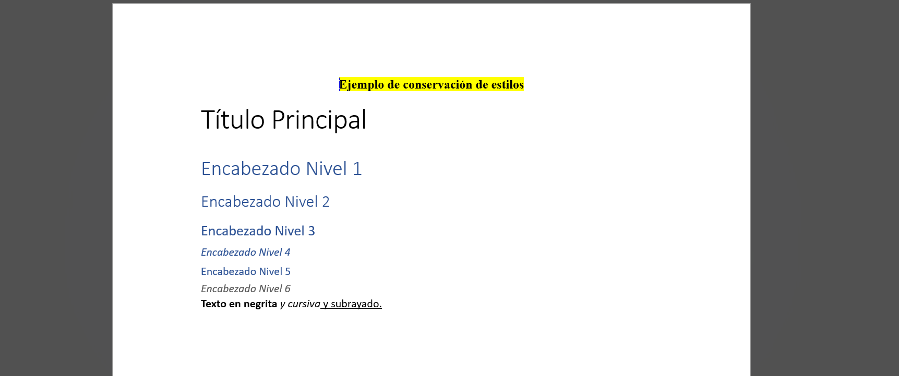

<p align="center">
    
</p>

<p align="center">
    Easily generate and modify .docx files with JS/TS. Works for Node and on the Browser.
</p>

---

[![NPM version][npm-image]][npm-url]
[![Downloads per month][downloads-image]][downloads-url]
[![GitHub Action Workflow Status][github-actions-workflow-image]][github-actions-workflow-url]
[![Known Vulnerabilities][snky-image]][snky-url]
[![PRs Welcome][pr-image]][pr-url]
[![codecov][codecov-image]][codecov-url]
[![Docx.js Editor][docxjs-editor-image]][docxjs-editor-url]


## **Cambios realizados en la Patcher API**

```
.
├── content-types-manager.ts
├── from-docx.ts
├── index.ts
├── paragraph-split-inject.ts
├── paragraph-token-replacer.ts
├── patch-detector.ts
├── relationship-manager.ts
├── replacer.ts
├── run-renderer.ts
├── style-extractor.ts
├── style-interceptor.ts
├── style-mapper.ts
├── traverser.ts
└── util.ts
```



### **1. `src/patcher/style-extractor.ts`**

**Propósito**: Extracción de estilos de documentos DOCX y elementos de patch

**Funcionalidades implementadas**:

- src/patcher/style-extractor.ts:15-25 - Interfaz `StyleInfo` para representar información de estilos
- src/patcher/style-extractor.ts:30-65 - `extractStylesFromDocx()` para extraer estilos del documento maestro usando JSZip
- src/patcher/style-extractor.ts:70-95 - `extractStylesFromPatchElements()` para detectar estilos en elementos de patch
- src/patcher/style-extractor.ts:100-120 - `createStyleInfoFromPatchIds()` para convertir IDs de estilo en objetos StyleInfo completos

### **2. `src/patcher/style-mapper.ts`**

**Propósito**: Mapeo bidireccional de estilos siguiendo el patrón ID→Nombre→ID de docxcompose-ts

**Funcionalidades implementadas**:

- src/patcher/style-mapper.ts:8-15 - Clase `StyleMapper` con mapas bidireccionales
- src/patcher/style-mapper.ts:17-30 - `createStyleIdMapping()` para establecer mapeos entre estilos de patch y documento maestro
- src/patcher/style-mapper.ts:32-42 - `mappedStyleId()` para transformar IDs de estilo con fallback al ID original
- src/patcher/style-mapper.ts:55-75 - Métodos de utilidad para debugging y estadísticas

### **3. `src/patcher/style-interceptor.ts`**

**Propósito**: Interceptación y transformación de XML para aplicar mapeo de estilos

**Funcionalidades implementadas**:

- src/patcher/style-interceptor.ts:5-10 - Clase `StyleInterceptor` para transformaciones XML
- src/patcher/style-interceptor.ts:15-55 - `traverseAndTransformStyles()` que maneja la estructura XML anidada `w:pPr → w:pStyle`
- src/patcher/style-interceptor.ts:60-75 - Transformación de atributos de estilo específicos

## **Archivos Modificados**

### **1. `src/export/formatter.ts`**

**Cambios implementados**:

- src/export/formatter.ts:1-5 - Imports añadidos para `StyleMapper` y `StyleInterceptor`
- src/export/formatter.ts:7-12 - Constructor modificado para aceptar `StyleMapper` opcional
- src/export/formatter.ts:14-25 - Integración del `StyleInterceptor` en el proceso de formateo XML

**Impacto**: Permite interceptar la generación XML en el punto exacto donde se convierte elementos a XML, aplicando transformaciones de estilo antes de la serialización final.

### **2. `src/patcher/replacer.ts`**

**Cambios implementados**:

- src/patcher/replacer.ts:22-34 - Parámetro `styleMapper` añadido a la interfaz del replacer
- src/patcher/replacer.ts:13 - Modificación para crear `Formatter` con `StyleMapper`
- src/patcher/replacer.ts:95-115 - Función `applyStyleMapping()` para transformar elementos del patch

**Impacto**: Integra el sistema de mapeo en el proceso de reemplazo de placeholders.

### **3. `src/patcher/from-docx.ts`**

**Cambios implementados**:

- src/patcher/from-docx.ts:20-21 - Imports añadidos para las nuevas funcionalidades de mapeo
- src/patcher/from-docx.ts:103-104 - Extracción de estilos del documento maestro
- src/patcher/from-docx.ts:179-205 - Integración del mapeo de estilos en el bucle principal de patching

**Impacto**: Coordina todo el sistema de mapeo dentro del flujo principal de `patchDocument`.

### **4. `src/patcher/index.ts`**

**Cambios implementados**:

- src/patcher/index.ts:3-4 - Exports añadidos para `style-extractor` y `style-mapper`

**Impacto**: Hace disponibles las nuevas funcionalidades como parte de la API pública del patcher.

## **Características del Sistema Implementado**

### **1. Mapeo Universal de Estilos**

- Funciona con cualquier combinación de idiomas (inglés ↔ español, etc.)
- Soporta estilos de párrafo, carácter, tabla y numeración
- Mapeo bidireccional usando nombres de estilo como puente universal

### **2. Interceptación a Nivel XML**

- Transformaciones aplicadas durante la generación XML en src/export/formatter.ts:20-24
- Maneja correctamente la estructura XML anidada de Word (`w:pPr → w:pStyle`)
- Preserva la integridad del documento durante las transformaciones

### **3. Compatibilidad y Robustez**

- Parámetros opcionales mantienen compatibilidad con código existente
- Fallback al estilo original cuando no hay mapeo disponible
- Sistema de logging para debugging y monitoreo

### **4. Integración Completa**

- Funciona automáticamente durante el proceso de patching
- No requiere configuración adicional del usuario
- Reutiliza la infraestructura existente de la Patcher API

Este sistema representa una implementación completa del mapeo universal de estilos, permitiendo que los patches mantengan sus estilos correctamente independientemente del idioma del documento maestro.

```bash
# Ejecutar demo
npx ts-node demo/100-test-style-interceptor.ts
```

[npm-image]: https://badge.fury.io/js/docx.svg
[npm-url]: https://npmjs.org/package/docx
[downloads-image]: https://img.shields.io/npm/dm/docx.svg
[downloads-url]: https://npmjs.org/package/docx
[github-actions-workflow-image]: https://github.com/dolanmiu/docx/workflows/Default/badge.svg
[github-actions-workflow-url]: https://github.com/dolanmiu/docx/actions
[snky-image]: https://snyk.io/test/github/dolanmiu/docx/badge.svg
[snky-url]: https://snyk.io/test/github/dolanmiu/docx
[pr-image]: https://img.shields.io/badge/PRs-welcome-brightgreen.svg
[pr-url]: http://makeapullrequest.com
[codecov-image]: https://codecov.io/gh/dolanmiu/docx/branch/master/graph/badge.svg
[codecov-url]: https://codecov.io/gh/dolanmiu/docx
[patreon-image]: https://user-images.githubusercontent.com/2917613/51251459-4e880480-1991-11e9-92bf-38b96675a9e2.png
[patreon-url]: https://www.patreon.com/dolanmiu
[browserstack-image]: https://user-images.githubusercontent.com/2917613/54233552-128e9d00-4505-11e9-88fb-025a4e04007c.png
[browserstack-url]: https://www.browserstack.com
[docxjs-editor-image]: https://img.shields.io/badge/Docx.js%20Editor-2b579a.svg?style=flat&amp;logo=javascript&amp;logoColor=white
[docxjs-editor-url]: https://docxjs-editor.vercel.app/
